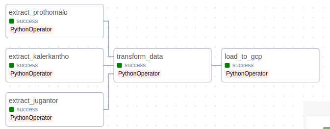

# AI News Generator Infrastructure

* Designed ETL in a dockerized Apache Airflow that aggregates data by scraping and storing them in a GCP bucket. Deployed in GCP compute engine.
* Created a Cloud Function trigger that inserts data to BigQuery if data is saved to the bucket by ETL.
* Developing another pipeline that generates news from the extracted data by using OpenAI API and designing schema for that.
* Done Ad-hoc analysis on Apache Spark (Databricks.)

[Check Apache Spark (Databricks) Analysis](https://databricks-prod-cloudfront.cloud.databricks.com/public/4027ec902e239c93eaaa8714f173bcfc/4774212859842620/259519912264515/2637933785655485/latest.html)


This Apache Airflow project implements an ETL (Extract, Transform, Load) pipeline for scraping news articles from various websites, translating them, and loading the data into Google Cloud Storage.

## Table of Contents

- [About](#about)
- [Getting Started](#getting-started)
- [DAG Structure](#dag-structure)
- [Functions](#functions)

## About

This project leverages Apache Airflow to automate the ETL process of collecting news articles, translating them into English, and storing them in a Google Cloud Storage bucket. The pipeline is designed to scrape data from three different news websites: Prothom Alo, Jugantor, and Kaler Kantho.



## Getting Started

To get started with this project, follow these steps:

1. **Clone the repository:**
   ```bash
   git clone https://github.com/espSiyam/Apache-Airflow.git
2. **Build the docker composer file:**
   ```bash
   docker-compose build
3. **Initialize the docker**
    ```bash
    docker-compose up airflow-init
4. **Run the dokcer image**
    ```bash
    docker-compose up

## DAG Structure
The Airflow DAG for this ETL pipeline is defined in the `ETL_Pipeline file (dags/ETL_Pipeline.py)`. It consists of the following tasks:

* **Data Extraction Tasks:**
    *  **extract_prothomalo:** Extracts news articles from Prothom Alo.
    * **extract_jugantor:** Extracts news articles from Jugantor.
    * **extract_kalerkantho:** Extracts news articles from Kaler Kantho.
* **Data Transformation Task:**
    * **transform_data:** Transforms the extracted data, including translating it into English and adding category information.
* **Data Loading Task:**
    * **load_to_gcp:** Loads the transformed data into Google Cloud Storage.
The tasks are organized in a sequence where data extraction tasks must complete before data transformation, and data transformation must complete before data loading.

For more details on the DAG's code structure, refer to the DAG file itself: `dags/ETL_Pipeline.py.`

## Functions
#### scrape_data_from_url(url):
* Description: Scrapes data (title, text, translated text, category, and main image) from a given news article URL.
* Usage: Used in the data extraction process.
* Input: url (str) - URL of the news article.
* Output: Dictionary containing scraped data.

#### transform_data():
* Description: Transforms and combines data from multiple sources, scrapes news articles, translates them, and saves the data as a CSV file.
* Usage: Used in the data transformation process.
* Output: Saves scraped and transformed data as a CSV file (scraped_data.csv).

#### load_to_gcp():
* Description: Loads the transformed data CSV file to Google Cloud Storage.
* Usage: Used in the data loading process.
* Output: Uploads the CSV file to the specified Google Cloud Storage bucket.

## Side notes:
After changing the requirement.txt:
1. build the composer: docker-compose build
2. docker-compose up